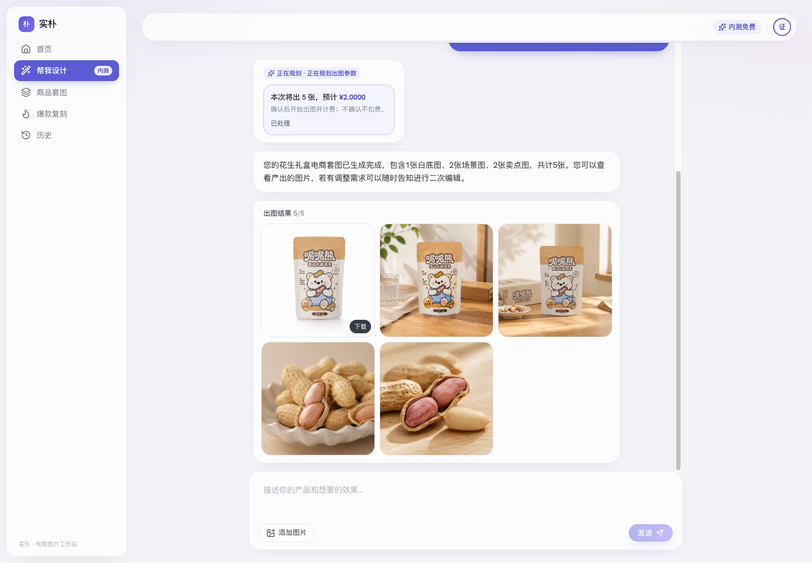

<div align="center">
  
  <h1>实朴 Shipu</h1>
  <p><strong>面向商品视觉生产的 AI 创作工作台。</strong></p>
  <p>从一句需求、一张商品图或一个视觉参考出发，在统一工作流中完成整套商品图片。</p>
  <p><a href="README.md">English</a> · <strong>简体中文</strong></p>
</div>



## 实朴能做什么

实朴将图像生成、视觉策划、二次修改与运营治理放进同一个工作台。它服务于真实的商品图片生产流程，而不只是一次性的提示词实验。

- **对话式设计。** 用自然语言描述商品与目标效果，添加参考图，确认预估成本，并在同一会话中持续调整。
- **生成完整商品套图。** 根据商品素材和商业需求，协同生成白底主图、场景图与卖点图。
- **复刻视觉方向。** 参考目标图片的构图与氛围，同时保持商品主体的一致性。
- **编辑图片与替换背景。** 对生成结果继续修改，保留图片链路，或将商品放入文字描述或参考图指定的场景。
- **追踪每一次产出。** 浏览生成历史、查看任务详情、下载结果，并从历史图片继续创作。

## 为创作团队，也为平台运营

实朴既提供聚焦创作的使用体验，也具备持续运营图像生成服务所需的控制能力。

| 创作工作流 | 运营控制 |
| --- | --- |
| 支持附件的对话式图像创作 | 设计师与管理者角色 |
| 商品套图、复刻、编辑与换背景 | 用户、生成任务与用量视图 |
| 模型感知的图片比例及标准、2K、4K 档位 | 在线模型配置与能力验证 |
| 持久化对话与生成历史 | 成本预算、调用记录、审计与运行日志 |
| 公开精选案例 | 内容审核与案例管理 |

## 灵活的模型层

模型能力在运行时配置，不与界面硬编码绑定。当前能力目录包含 GPT Image 2、Nano Banana 2 和 Wan 2.7 Image Pro，并实现了四类提供商协议：

- OpenAI 兼容图像 API
- Gemini 原生图像 API
- 阿里云百炼 Wan API
- OpenAI 兼容对话 API

每个模型独立声明输出比例、渲染档位、参考图支持、提供商限制与单位成本。模型凭据加密后持久化，管理者可在启用连接前完成能力验证。

## 系统架构

```text
React 19 + Vite 8
        │  类型化 OpenAPI 客户端
        ▼
FastAPI API ───── JWT 认证 · SSE 事件 · Prometheus 指标
        │
        ├── MySQL / SQLite ── 用户 · 会话 · 任务 · 模型调用 · 审计数据
        ├── Redis Streams ─── 持久队列 · 准入控制 · 进度事件
        └── 生成 Worker
                 ├── 模型提供商
                 └── 本地存储 / 火山引擎 TOS
```

API 负责接收并校验任务，通过 Outbox 持久化提交，并向客户端推送进度。独立 Worker 领取生成项、控制并发、调用选定模型并保存结果。明确的任务状态转换让取消、超时、失败和提交状态不确定都可被识别，不会静默丢失任务。

生产编排进一步加入 Nginx、Redis 持久化、MySQL、API 与 Worker 健康检查、带 DKIM 签名的 SMTP、不可变发布目录和自动回滚保护。

## 仓库结构

```text
image-code/   FastAPI 服务、领域逻辑、Worker、数据库迁移与 Python 测试
image-web/    React 应用、类型化 API 客户端、组件与浏览器侧测试
image-ops/    Docker、Nginx、邮件、发布、回滚与基础设施脚本
image-qa/     真实服务验收、边界、安全与回归探测脚本
```

## 本地开发

### 环境要求

- Python 3.12 或更高版本
- [uv](https://docs.astral.sh/uv/)
- Node.js 与 npm
- Redis 8

### 启动后端

进入 `image-code/`：

```bash
uv sync --group dev
uv run alembic upgrade head
uv run uvicorn design_hub.interface.api.asgi:app --reload
```

开发环境默认使用 SQLite 与本地文件存储。API 默认连接 `redis://127.0.0.1:6379/0`；如 Redis 位于其他地址，请设置 `REDIS_URL`。

在第二个终端启动生成 Worker：

```bash
cd image-code
uv run python -m design_hub.interface.worker
```

如需创建本地管理者账号，请在启动 API 前设置 `SEED_ADMIN_EMAIL` 与 `SEED_ADMIN_PASSWORD`。随后可在管理端模型控制台添加、验证并启用图像与对话模型。

### 启动前端

进入 `image-web/`：

```bash
npm ci
npm run dev
```

访问 `http://localhost:3000`。Vite 会将 `/api` 代理至 `http://127.0.0.1:8000`；如需连接其他后端，可设置 `VITE_API_TARGET`。

没有模型凭据时，也可以使用后端自带的本地 Mock 启动器进行界面联调：

```bash
cd image-code
bash scripts/run_local_mock.sh
```

该启动器使用 SQLite、本地存储以及 Mock 文本和图像提供商，不会调用产生费用的上游服务。

## 质量验证

仓库当前包含 67 个 Python 测试文件和 38 个前端测试文件，另有真实模型服务 QA 探测脚本。以下命令覆盖 CI 使用的核心检查：

```bash
cd image-code
uv run ruff check
uv run mypy
uv run pytest

cd ../image-web
npm run lint
npm run typecheck
npm run test
npm run build
```

## 生产交付

生产环境定义在 `image-ops/deploy/compose.yml`。发布脚本会构建前端、暂存不可变版本、执行数据库迁移、验证服务健康状态、切换当前版本，并保留回滚路径。

生产环境需要在仓库之外妥善管理 MySQL 连接、Redis 凭据、JWT 与加密密钥、存储参数、邮件身份和模型配置。面向公网部署时，请勿使用任何开发默认值。

---

<div align="center">
  <strong>实朴，让商品图片生产从分散的工具链，变成一个可追踪的完整工作流。</strong>
</div>
