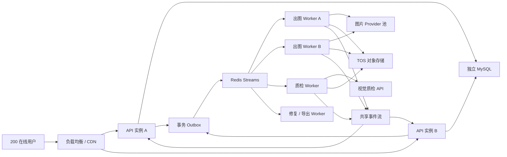
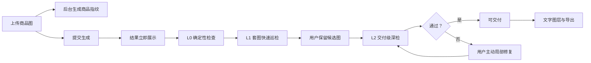

# 质量交付闭环与 Redis Streams 任务架构设计

> 日期：2026-07-28
>
> 状态：设计已确认，待用户评审本文后进入实施计划
>
> 适用范围：商品套图、爆款复刻、二次编辑、Chat 出图
>
> 容量基线：上线预期 200 人同时在线，其中约 20% 同时生成

## 1. 决策摘要

本轮不是继续增加孤立的生图入口，而是增加一套可交付的质量闭环：

1. AI 质检官；
2. 商品保真修复笔；
3. 精准文字图层；
4. Redis Streams 持久化任务队列；
5. 结构化日志、任务指标与错误追踪。

实施按“基础设施先行、质量能力分层上线”的顺序推进：

1. Redis Streams、事务 Outbox、图片子任务和全局并发控制；
2. 结构化日志、业务指标、错误编号和任务恢复；
3. L0 确定性质检与商品指纹；
4. L1 套图快速质检与 L2 交付深检；
5. 商品保真修复笔；
6. 精准文字图层。

本设计坚持以下原则：

- 结果先展示，质检不阻塞首图；
- 出图、质检、修复、导出互不抢占容量；
- 消息可重复投递，业务执行必须幂等；
- 错误必须进入明确终态，禁止永久“生成中”；
- 日志能够用一个 `request_id` 串起完整链路；
- 不引入 Kubernetes、Kafka、复杂工作流引擎或多地域部署；
- 不保留生产用旧内存队列兼容层，旧代码迁移到新契约后删除。

## 2. 背景与问题

当前生产形态为单机部署：Nginx、FastAPI、MySQL 同机，服务器为 2C/3.8GB。出图任务由 API 进程内的 `asyncio.create_task` 执行，事件由进程内总线转发，限流状态也保存在内存中。

该形态适合低并发内测，但不适合 200 人上线预期：

- API 进程重启会中断在途任务；
- 队列没有容量上限和持久化；
- 多实例之间无法共享任务、限流和 SSE 事件；
- 每个套图任务独立并发，多个用户会叠加打满上游；
- 上游 API 曾在低并发下出现 429 和部分失败；
- Prompt 已声明商品保真，但出图后缺少自动验证；
- 图上营销文字仍由模型渲染，存在偶发错字；
- 当前日志不足以跨 API、Worker、Provider 定位完整链路。

## 3. 目标与非目标

### 3.1 目标

- 200 人同时在线时，API 仍可稳定接单、查询和接收进度。
- 普通高峰按 40 个用户同时生成、每单 5 张设计容量。
- 所有生成任务可排队、恢复、取消和追踪。
- 不因质检 API 变慢或故障而拖慢图片生成。
- 用户能够知道图片是否通过、哪里有问题以及如何修复。
- 新增营销文案逐字正确，并保持可编辑。
- Worker 或 API 重启后不丢任务、不重复出图、不重复计费。
- 线上错误可通过 `request_id`、`job_id` 或 `provider_task_id` 定位。

### 3.2 非目标

- 不保证 200 人在同一秒提交 5 张套图后全部 5 分钟内完成。
- 不在当前服务器部署本地 OCR、视觉模型或 GPU 服务。
- 不建设 Photoshop 式完整画布。
- 不做自动无限重生。
- 不做多地域容灾、自动弹性伸缩或 Kubernetes。
- 不做 Kafka、RabbitMQ 与 Redis 多 Broker 并存。
- 不把消息队列抽象成支持任意 Broker 的通用平台。

## 4. 容量模型与服务目标

### 4.1 容量假设

- 同时在线用户：200；
- 同时生成比例：20%，即 40 个任务；
- 默认套图：5 张；
- 同批图片子任务：200；
- 当前异步 Provider 参考耗时：约 70 秒/张；
- 普通高峰完整套图目标：P95 不超过 5 分钟。

所需上游并发近似为：

```text
所需并发 = 图片任务数 × 平均处理秒数 ÷ 目标完成秒数
         = 200 × 70 ÷ 300
         ≈ 47
```

增加约 20% 余量后，Provider 目标容量为 56–60 个并发图片任务。该数字必须通过上游正式配额和真实压测验证；未获得足够配额时，系统通过队列稳定接单并展示预计等待时间，不虚假承诺 5 分钟。

### 4.2 性能目标

- 提交任务 API：P95 ≤ 500ms；
- 首图展示：质检带来的额外延迟 ≤ 1s；
- L0 质检：单图 P95 ≤ 100ms；
- L1 快速质检：末张完成后 P95 ≤ 15s；
- L2 深检：P95 ≤ 20s；
- API 5xx：五分钟窗口 < 1%；
- 任务丢失：0；
- 重复计费：0；
- 质检故障不得降低出图成功率。

## 5. 总体架构



建议初始部署基线：

| 组件 | 初始规格 |
|---|---|
| API | 2 实例，每实例 2C/4GB |
| 出图 Worker | 2 实例，每实例 2C/4GB |
| 质检 Worker | 1 实例，2C/4GB |
| 修复/导出 Worker | 1 实例，2C/4GB |
| MySQL | 独立 2C/4GB 起步 |
| Redis | 托管 Redis 1–2GB，开启持久化 |
| 图片 | TOS 对象存储 |
| 日志 | Loki 或云日志 |
| 指标 | Prometheus + Grafana |
| 异常 | Sentry |

规格是压测起点，不是未经验证的长期定容。

## 6. Redis Streams 任务设计

### 6.1 为什么选择 Redis Streams

Redis Streams 满足本轮需要的持久消息、Consumer Group、ACK、Pending 接管、共享限流和事件广播，同时避免 RabbitMQ 或 Kafka 的额外运维面。

Redis 使用托管实例，不与当前 2C/3.8GB 服务器竞争内存和磁盘。当前服务器转为 QA 环境；生产 API、Worker、MySQL 分离部署。

### 6.2 队列划分

第一期只保留必要的三条任务流：

| Stream | 内容 | 说明 |
|---|---|---|
| `generation` | 普通 1K 与 4K 图片子任务 | 消息内带 `render_tier`，调度器分配独立配额 |
| `quality` | 商品指纹、L1 快检、L2 深检 | 低于生成优先级 |
| `media` | 局部修复、文字合成、最终导出 | 独立 Worker，避免阻塞 API |

不为每一种操作创建独立 Stream。不同任务类型由消息的 `operation_type` 区分；只有容量和执行资源显著不同的三类工作才拆流。

### 6.3 消息粒度

一套图拆为一个 `GenerationJob` 和多个 `GenerationItem`。每张目标图对应一个 Item 和一条生成消息。

这样可以实现：

- 全局图片级并发；
- 第一张优先；
- 用户间公平轮转；
- 单张失败不拖垮整套；
- 精确计费和耗时统计；
- Worker 崩溃后从单张粒度恢复。

### 6.4 消息信封

```json
{
  "schema_version": 1,
  "message_id": "msg_...",
  "trace_id": "trace_...",
  "request_id": "req_...",
  "job_id": "job_...",
  "operation_id": "op_...",
  "operation_type": "generate_image",
  "user_id": "user_...",
  "created_at": "2026-07-28T00:00:00Z"
}
```

消息只携带标识和路由字段，不携带图片字节、完整 Prompt、密钥或预签名 URL。Worker 通过数据库读取任务快照，再由签名器生成短期 URL。

### 6.5 事务 Outbox

提交请求时，在同一数据库事务内完成：

1. 创建 `GenerationJob`；
2. 创建 `GenerationItem`；
3. 写成本预扣；
4. 写 `OutboxEvent`。

Dispatcher 将未发布 Outbox 写入 Redis Streams，成功后标记 `published_at`。API 在数据库
事务提交后立即返回 `202 + job_id`，不等待 Provider 完成。API 接单前检查最近一次 Redis
健康状态；Redis 已确认不可用时拒绝新出图任务。若 Redis 恰好在数据库事务提交后故障，
Outbox 保留该次已接任务并在恢复后发布，从而只覆盖提交竞态，不把数据库当成备用队列。

### 6.6 Consumer 与 ACK

- Worker 使用 Consumer Group 领取消息；
- 数据库条件更新成功后才开始执行；
- 执行期间维护租约和心跳；
- 终态和计费回正提交成功后再 ACK；
- Worker 崩溃后，其他 Worker 接管 Pending 消息；
- 已完成任务收到重复消息时直接 ACK；
- 已有 `provider_task_id` 时只能继续轮询，不得重新提交。

### 6.7 全局并发与公平性

- Provider 并发额度是全局配置，不再属于单个 Job；
- 每个 Provider、模型和 Key 组独立限流；
- 每位用户最多 1 个活跃套图任务；
- 每位用户同时在途图片最多 2 张；
- API 创建全部 Item，但初始只为第 1 张写可发布 Outbox；第 1 张进入 `submitted` 后释放
  第 2 张，任一在途 Item 终态后再按序释放下一张，始终保持每用户最多 2 张在途；
- 该释放规则保证所有新 Job 的首图先进入全局队列，不引入额外优先级队列或复杂调度器；
- 4K 使用独立额度，不能占满普通 1K 槽位；
- 质检和媒体任务不消耗图片生成槽位。

### 6.8 背压

系统根据队列深度、历史平均耗时和可用槽位估算等待时间：

```text
预计等待秒数 = 前方图片任务数 × 滚动平均处理秒数 ÷ 可用槽位
```

- 预计等待 < 5 分钟：正常接单；
- 5–15 分钟：明确显示高峰排队；
- > 15 分钟：用户确认后提交；
- 超过硬容量或 Redis 已确认不可用：拒绝新任务，不接受后无限等待。

## 7. 任务状态机与幂等

### 7.1 GenerationItem 状态

```text
waiting
→ queued
→ claimed
→ submitting
→ submitted
→ processing
→ storing
→ generated
```

异常终态：

```text
cancelled / timed_out / failed / submission_uncertain
```

每次状态变化使用条件更新。例如只有 `queued` 可以变为 `claimed`，只有 `claimed` 可以提交 Provider。状态不匹配即停止执行并记录不变量错误。

### 7.2 幂等

- HTTP 提交使用用户级唯一 `idempotency_key`；
- 每个图片操作使用唯一 `operation_id`；
- Worker 执行由数据库状态和租约共同守门；
- 计费预扣、回正和退款各自使用唯一账本操作键；
- Provider 支持幂等键时传 `operation_id`；
- Provider 不支持幂等键时，提交前进入 `submitting`；提交成功后立即保存
  `provider_task_id` 并进入 `submitted`；
- `submitting` 状态租约过期且没有 `provider_task_id` 时，进入 `submission_uncertain`，
  禁止自动重投，避免同一图片被重复生成和重复计费；第一期触发告警并由运维人工核对
  Provider 记录，不建设自动对账系统；
- 业务校验错误不重试；
- 仅 429、5xx、网络超时允许在总墙钟内有限重试。

## 8. 质量交付闭环

### 8.1 数据流



### 8.2 商品指纹

商品指纹按“上传文件 SHA-256 + 指纹策略版本”缓存，包含：

- 商品数量与类别；
- 主体轮廓和比例；
- 主色与辅助色；
- 材质特征；
- Logo 区域；
- 可识别包装文字；
- 品类关键结构；
- 用户手动标记的不可修改区域。

指纹在上传完成后异步生成，与用户填写需求和 Provider 出图并行。同一商品图重复使用时直接复用。

### 8.3 L0 确定性检查

L0 不调用视觉 API，不执行本地 OCR，不解码多张 4K 图片：

- 文件格式、尺寸和比例；
- 请求张数与实得张数；
- 文件完整性和对象存储可读性；
- 文字图层数据与用户输入逐字一致；
- 修复后蒙版外像素不变；
- 任务和计费终态一致。

### 8.4 L1 套图快速质检

一套图完成后调用一次多图视觉 API，检查：

- 商品是否缺失或数量错误；
- 是否有明显外形变化和改色；
- 是否出现无关文字、水印、商品或人体；
- 白底图是否满足白底要求；
- 同套图片是否存在明显不一致。

L1 不阻塞结果展示。API 故障时状态为 `inspection_unavailable`，不能默认为通过。

### 8.5 L2 交付级深检

只在用户保留、高清预览、下载或主动深检时执行，检查：

- Logo 缺失、替换或变形；
- 品牌名、型号和关键包装文字；
- 瓶盖、泵头、接口、摄像头、鞋底、印花等结构；
- 材质和色号；
- 新增营销文案；
- 用户标记的不可修改区域。

### 8.6 判定

结果不用单一总分掩盖关键错误，采用：

- `passed`：未发现影响交付的问题；
- `warning`：证据不足，需要用户确认；
- `failed`：确定性错误，不能标记为可交付；
- `inspection_unavailable`：质检未完成。

每个问题必须包含：

- 问题类型；
- 严重度；
- 图片区域；
- 证据摘要；
- 检测器置信度；
- 建议动作；
- 质检策略版本。

确定性规则可直接失败。视觉问题需两个独立证据一致才自动失败；只有一个证据时标为警告。

### 8.7 视觉 Provider 准入

L1/L2 的首选候选为 Kimi K3，但 Stage B 开工前必须用真实商品图验证：

- 支持通过预签名 URL 读取多张图片；
- 一次请求至少容纳 1 张商品锚图和默认 5 张结果图；
- 支持严格 JSON Schema 输出；
- L1 P95 ≤ 15 秒，L2 P95 ≤ 20 秒；
- 结构化输出成功率 ≥ 99%；
- 不在服务端日志或训练声明中泄漏用户图片。

任一硬条件不满足，则停止 Stage B 并回报用户，不在代码中加入静默降级或第二候选
兼容逻辑。Stage A 的 Redis、日志和可靠任务底座不依赖视觉 Provider，可独立交付。

## 9. 商品保真修复笔

第一期只做局部修复：

- 用户涂抹错误区域；
- 当前结果图是编辑基底；
- 原商品图是保真锚点；
- 蒙版是唯一允许生成修改的区域；
- 后端只合成蒙版区域，蒙版外保持原像素；
- 蒙版边缘允许固定宽度融合带；
- 修复结果创建新版本，不覆盖原图；
- 修复完成后自动进入 L2 深检。

第一期不做自由图层、滤镜、钢笔工具或复杂选区。Provider 必须声明蒙版能力；不支持蒙版的 Provider 不进入修复路由。

## 10. 精准文字图层

新增营销文案不再默认交给图片模型渲染，而是保存为结构化文字图层：

```json
{
  "id": "text_...",
  "content": "高山七彩花生",
  "font_family": "Noto Sans SC",
  "font_size": 64,
  "font_weight": 700,
  "color": "#111111",
  "x": 0.12,
  "y": 0.10,
  "width": 0.36,
  "align": "left",
  "rotation": 0
}
```

- 浏览器负责实时预览；
- 服务端在最终导出时进行确定性合成；
- 图层内容与用户输入逐字一致；
- 商品包装原有文字仍属于商品像素，由质量检查保护；
- 艺术字和环境融合文字不进入第一期。

## 11. 数据模型

本设计需要数据库迁移，实施迁移前再次取得用户明确许可。

新增或调整的核心模型：

### 11.1 `generation_item`

- `id`
- `job_id`
- `sequence`
- `image_type`
- `render_tier`
- `status`
- `operation_id`
- `worker_id`
- `provider`
- `provider_task_id`
- `lease_expires_at`
- `heartbeat_at`
- `attempt_count`
- `error_code`
- `error_detail`
- `created_at`
- `updated_at`

### 11.2 `outbox_event`

- `id`
- `aggregate_type`
- `aggregate_id`
- `event_type`
- `payload`
- `created_at`
- `published_at`
- `publish_attempts`
- `last_error`

### 11.3 `product_fingerprint`

- `id`
- `owner_id`
- `upload_id`
- `content_sha256`
- `policy_version`
- `fingerprint`
- `status`
- `error_code`
- `created_at`

唯一键为 `(owner_id, content_sha256, policy_version)`。

### 11.4 `quality_report`

- `id`
- `image_id`
- `stage`
- `status`
- `policy_version`
- `issues`
- `provider`
- `latency_ms`
- `error_code`
- `created_at`

### 11.5 图片版本字段

现有图片实体增加：

- `source_image_id`
- `version_no`
- `text_layers`
- `quality_status`

修复和文字合成结果通过版本链关联，不覆盖源图。

## 12. API 与事件

### 12.1 核心 API

- `POST /listing/jobs`：幂等创建任务，返回 `202`；
- `GET /listing/jobs/{job_id}`：查询聚合状态、排队信息和图片；
- `POST /images/{image_id}/keep`：保留并触发 L2；
- `GET /images/{image_id}/quality`：读取质检报告；
- `POST /images/{image_id}/quality/deep`：主动深检；
- `POST /images/{image_id}/repairs`：提交蒙版修复；
- `PUT /images/{image_id}/text-layers`：保存文字图层；
- `POST /images/{image_id}/export`：确定性合成并导出；
- `POST /listing/jobs/{job_id}/cancel`：取消未终态子任务。

路由名称在实施计划中与现有 OpenAPI 合并；不保留重复旧端点。

### 12.2 SSE 事件

- `job_queued`
- `queue_estimate_updated`
- `image_started`
- `image_generated`
- `image_failed`
- `quality_started`
- `quality_completed`
- `repair_started`
- `repair_completed`
- `job_completed`

SSE 使用共享事件源。刷新页面后以 `GET /listing/jobs/{job_id}` 的数据库状态恢复，不依赖事件回放完成业务恢复。

## 13. 结构化日志与错误追踪

### 13.1 日志字段

所有服务输出统一 JSON：

- `timestamp`
- `level`
- `service`
- `instance_id`
- `event`
- `trace_id`
- `request_id`
- `user_id_hash`
- `job_id`
- `generation_item_id`
- `quality_task_id`
- `provider`
- `provider_task_id`
- `from_status`
- `to_status`
- `queue_wait_ms`
- `provider_latency_ms`
- `total_elapsed_ms`
- `attempt_count`
- `error_code`
- `error_class`
- `retryable`
- `recipe_version`
- `quality_policy_version`

第一期复用项目已有 `structlog`、Prometheus Instrumentator 和 Sentry，不再引入
OpenTelemetry 或第二套日志 SDK。应用只向标准输出写 JSON；部署环境优先接现有云日志，
没有云日志时再由 Ops 部署 Loki，业务代码不感知日志落点。

### 13.2 生命周期事件

- `job.accepted`
- `job.enqueued`
- `worker.claimed`
- `provider.submitted`
- `provider.completed`
- `image.stored`
- `quality.started`
- `quality.completed`
- `repair.started`
- `repair.completed`
- `billing.reserved`
- `billing.reconciled`
- `job.completed`
- `job.failed`

轮询不逐次写 INFO。终态一次记录总轮询次数、排队时间和执行时间。

### 13.3 日志安全

禁止记录 API Key、JWT、密码、完整预签名 URL、邮箱、手机号、原始图片、完整 Prompt。只记录脱敏用户标识、对象 Key、Prompt 哈希、长度和错误摘要。

### 13.4 用户错误编号

所有错误响应包含：

```json
{
  "error": {
    "code": "PROVIDER_RATE_LIMITED",
    "message": "图像服务繁忙，任务已进入等待队列",
    "request_id": "req_...",
    "retryable": true
  }
}
```

同一个 `request_id` 必须贯穿 API、Outbox、Redis、Worker、Provider 和质检日志。

## 14. 指标与告警

必须采集：

- API QPS、P95、P99、5xx；
- SSE 连接数；
- Stream 长度、Pending、最老消息等待时间；
- Outbox 未发布数量和延迟；
- Worker 在途数、心跳和租约接管；
- Provider 提交量、429、5xx、超时、成功率；
- Provider 排队、执行和总耗时；
- 单张与整套图耗时；
- 质检调用量、延迟、失败率；
- 修复成功率；
- 数据库连接池使用率；
- CPU、内存、磁盘和事件循环延迟；
- 预扣未回正数量。

告警阈值：

- API 5xx 五分钟 > 1%；
- Provider 失败率五分钟 > 5%；
- Provider 429 五分钟 > 3%；
- 最老生成任务排队 > 120 秒；
- Outbox 未发布 > 10 秒；
- Worker 心跳中断 > 30 秒；
- MySQL 连接池使用率 > 80%；
- 队列持续增长 10 分钟；
- 服务内存 > 75%；
- 质检失败率 > 10%；
- 预扣超过 15 分钟未回正。

## 15. 错误处理

- 参数和业务规则错误立即失败，不重试；
- Redis 不可用时不接受新出图任务；
- Outbox Dispatcher 网络错误按 I/O 规则有限重试；
- Provider 429、5xx、超时在总墙钟内有限重试；
- Provider 明确失败终态不重投；
- 质检失败不影响图片可见性，但不得标记通过；
- 修复失败保留原图和原质检报告；
- 导出失败不改变图片和文字图层；
- 所有失败写技术日志，用户只看到稳定错误码和人话文案。

## 16. 测试与验收

### 16.1 功能验证

- 提交幂等；
- Outbox 原子性；
- 重复消息不重复执行；
- Worker 宕机接管；
- Provider 已提交任务恢复轮询；
- 取消传播；
- 部分完成聚合；
- 计费预扣、回正和退款；
- L0/L1/L2 状态；
- 蒙版外像素保持；
- 文字图层逐字正确；
- 质检不可用时出图不受影响；
- API 和 Worker 日志可按 `request_id` 串联。

### 16.2 故障注入

- Redis 短暂断连；
- MySQL 慢查询和连接耗尽；
- Worker 在提交前、提交后、转存前和计费回正前退出；
- Provider 429、500、超时和错误完成体；
- TOS 上传失败；
- 视觉质检 API 超时；
- 重复投递和乱序事件；
- API 滚动重启。

### 16.3 容量验证

- 200 个登录态和 SSE 连接；
- 200 用户同时读取首页、历史和详情；
- 40 用户同时提交 5 张套图；
- Mock Provider 完整跑 200 个图片子任务；
- 真实 Provider 按核准额度逐步压到 60 并发；
- 观察 API P95、队列等待、Redis Pending、Worker 内存、DB 连接和任务成功率。

## 17. 发布顺序

### 阶段 A：可靠任务底座

- 数据模型迁移；
- Redis Streams；
- Outbox Dispatcher；
- 图片子任务；
- 全局并发和用户公平调度；
- Worker 租约、恢复和取消；
- 共享 SSE 事件；
- 结构化日志、指标和告警。

阶段 A 只迁移现有出图能力，不增加质量功能。现有出图全链通过后删除生产用内存队列。

### 阶段 B：轻量质量闭环

- 商品指纹；
- L0 确定性检查；
- L1 套图快检；
- 质量报告 UI；
- 质检故障隔离。

### 阶段 C：交付质量

- L2 深检；
- 商品保真修复笔；
- 图片版本链；
- 精准文字图层；
- 确定性导出。

每个阶段独立验收和部署，不将全部功能压成一次大发布。

## 18. 设计约束总结

- Redis Streams 是唯一生产任务 Broker；
- MySQL 是任务状态、计费和 Outbox 的事实源；
- TOS 是图片事实源；
- API 无状态；
- Worker 执行任务，API 不执行长任务；
- 每张图片是独立任务；
- Provider 并发是全局额度；
- 质检不阻塞首图；
- 深检只针对保留图；
- 修复由用户主动触发；
- 新增营销文字走确定性图层；
- 生产旧内存队列迁移完成后删除；
- 数据库迁移和生产资源采购在实施前分别取得用户确认。
